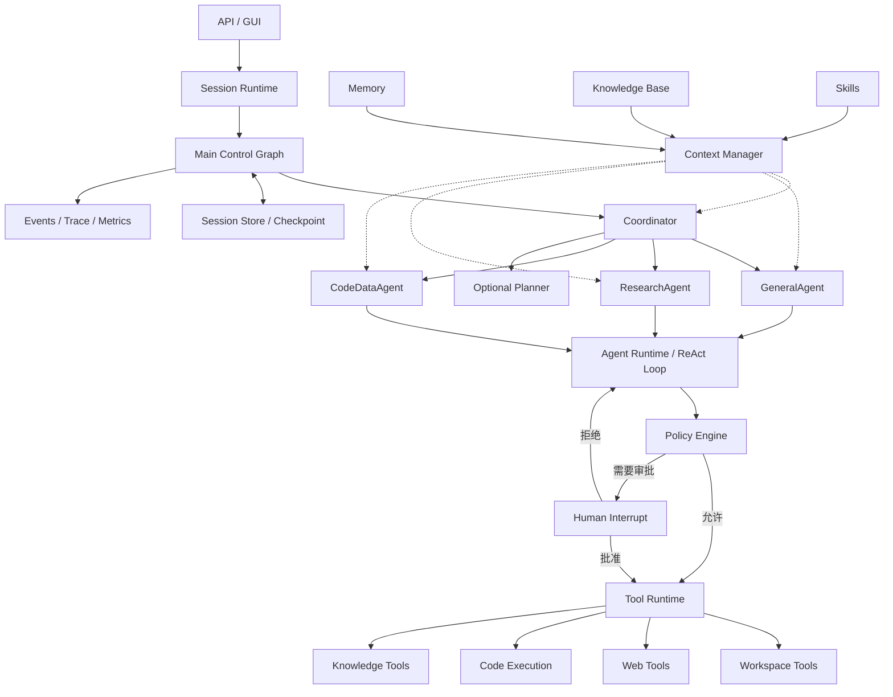
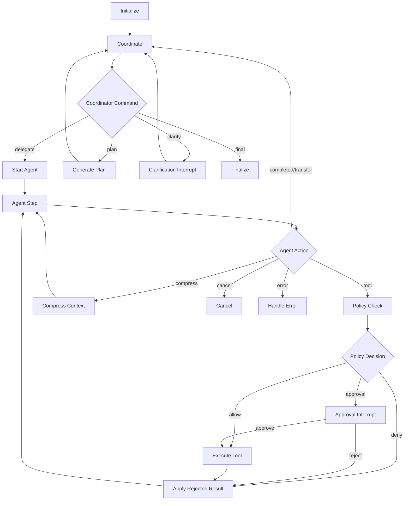

# Agent Dogs Runtime Architecture V2

## 1. 文档目的

本文档定义 Agent Dogs 下一代 Agent Runtime 的目标架构、模块边界、运行协议、状态模型和迁移路径，用于指导后续代码重构。

新架构需要同时满足两个目标：

1. **可控制**：会话并发、状态转换、权限、审批、取消、超时、预算和持久化必须由代码控制。
2. **可动态决策**：Agent 可以根据模型输出和工具结果动态决定下一步，不再依赖一次性的固定任务分类。

目标架构不是纯固定 Workflow，也不是完全自治的单体 ReAct 循环，而是：

> Session Runtime + Control Graph + Coordinator + 受限领域 ReAct Agent + Tool Runtime。

横向配套系统包括：

- Policy Engine
- Context Manager
- Memory
- Knowledge
- Skills
- Session Store
- Observability

## 2. 设计原则

### 2.1 控制权分离

- LLM 决定“希望做什么”。
- Graph 决定“当前状态允许进入什么状态”。
- Policy Engine 决定“该动作是否允许执行”。
- Tool Runtime 决定“动作如何被可靠执行”。
- Context Manager 决定“本次模型调用能够看到什么”。
- Session Runtime 决定“该会话是否允许开始或继续运行”。

### 2.2 不按工具类型拆 Agent

文件读取、搜索和代码执行首先是工具能力，不等同于 Agent。

固定 Agent 仅在以下条件下建立：

- 需要专门的系统提示词；
- 拥有明显不同的权限；
- 需要独立上下文；
- 有不同的验收标准；
- 有不同的成本和迭代预算；
- 内部需要多轮推理和工具调用。

V2 初始只保留三个固定执行 Agent：

- GeneralAgent
- ResearchAgent
- CodeDataAgent

### 2.3 状态显式化

业务状态不得主要隐藏在长期存活的 Python 对象字段中。影响恢复、并发和路由的状态必须进入可序列化的 `AgentState`。

### 2.4 协议结构化

Coordinator、Agent、Policy 和 Tool 之间使用结构化数据通信，不通过解析自然语言判断下一步。

### 2.5 默认最小权限

Agent 只获得完成当前任务需要的工具。Skill 不能扩大 Agent 权限，模型也不能自行请求未授权工具。

### 2.6 中间轨迹与主对话分离

主对话保存用户消息和最终结果。领域 Agent 的大量工具轨迹保存在独立工作上下文和事件日志中，通过结构化摘要返回 Coordinator。

## 3. 总体架构



## 4. 第一层：Session Runtime

### 4.1 定位

Session Runtime 是会话和任务运行的隔离边界。它不理解任务语义，不决定调用哪个 Agent。

### 4.2 职责

- 创建、读取、删除会话；
- 为每次用户请求创建唯一 `run_id`；
- 保证同一会话中的 Run 串行执行；
- 允许不同会话并行；
- 管理取消令牌；
- 拒绝迟到的旧 Run 结果；
- 将粗粒度状态同步给 API 和 GUI；
- 加载和保存会话状态；
- 在进程重启后恢复可恢复的 Graph checkpoint。

### 4.3 会话状态

```python
SessionStatus = Literal[
    "idle",
    "running",
    "waiting_user",
    "cancelling",
    "failed",
]
```

Session 状态只表达会话是否可以接受新工作，不表达全部 Graph 细节。

### 4.4 Run 模型

```python
class AgentRun(BaseModel):
    run_id: str
    session_id: str
    status: str
    created_at: datetime
    started_at: datetime | None = None
    finished_at: datetime | None = None
    cancellation_requested: bool = False
```

### 4.5 并发规则

1. 一个 Session 同时最多存在一个 active run。
2. Session 处于 `running`、`waiting_user` 或 `cancelling` 时，不得直接创建第二个 Run。
3. 不同 Session 可以在独立任务中并行执行。
4. 所有模型和工具结果在写入状态前必须验证 `run_id`。
5. Cancel 后必须等旧 Run 真正退出或被隔离，Session 才能回到 `idle`。

### 4.6 建议接口

```python
class SessionRuntime:
    async def submit_message(
        self,
        session_id: str,
        message: str,
        options: RunOptions,
    ) -> RunResult: ...

    async def resume(
        self,
        session_id: str,
        interrupt_id: str,
        payload: dict,
    ) -> RunResult: ...

    async def cancel(
        self,
        session_id: str,
        run_id: str,
    ) -> CancelResult: ...
```

## 5. 第二层：Main Control Graph

### 5.1 定位

Control Graph 是任务运行的确定性外壳，负责状态转换、暂停、恢复、失败和终止。

Graph 不负责详细业务分类。它只识别标准化 Command、Action、PolicyDecision 和 ToolResult。

### 5.2 Graph 控制的内容

- 初始化一次 Run；
- 调用 Coordinator；
- 启动指定领域 Agent；
- 驱动 Agent 单步推理；
- 检查 ToolCall 权限；
- 执行普通工具；
- 对高风险工具发起 interrupt；
- 将 ToolResult 返回正确 Agent；
- 处理澄清；
- 处理 Planner；
- 触发上下文压缩；
- 检查预算；
- 处理取消；
- 最终汇总和持久化。

### 5.3 Graph 不控制的内容

- 具体搜索关键词；
- 应读取哪个业务文件；
- Python 分析代码内容；
- 研究是否需要追加一次搜索；
- 领域内的推理过程。

### 5.4 Run 状态

```python
RunStatus = Literal[
    "initializing",
    "coordinating",
    "running_agent",
    "waiting_tool",
    "waiting_approval",
    "waiting_clarification",
    "planning",
    "compressing",
    "finalizing",
    "completed",
    "cancelled",
    "failed",
]
```

### 5.5 AgentState

```python
class AgentState(TypedDict):
    session_id: str
    run_id: str
    status: RunStatus

    user_input: str
    conversation_messages: list[BaseMessage]

    coordinator_command: CoordinatorCommand | None
    plan: TaskPlan | None
    completed_tasks: list[TaskResult]

    active_agent: str | None
    active_task: AgentTask | None
    agent_messages: list[BaseMessage]

    pending_tool_calls: list[ToolCall]
    tool_results: list[ToolResult]

    pending_approval: ApprovalRequest | None
    pending_clarification: ClarificationRequest | None

    iteration: int
    max_iterations: int
    token_estimate: int

    final_response: str | None
    errors: list[AgentError]
    events: list[AgentEvent]
```

### 5.6 状态由谁判断

状态转换采用“LLM 语义判断 + 代码规则路由”。

LLM 可以产生：

```json
{
  "type": "delegate",
  "target_agent": "research",
  "goal": "研究当前市场趋势"
}
```

代码根据 `type` 决定 Graph 边：

```python
def route_coordinator_command(state: AgentState) -> str:
    command = state["coordinator_command"]
    return {
        "delegate": "start_agent",
        "plan": "generate_plan",
        "clarify": "clarification_interrupt",
        "final": "finalize",
        "fail": "handle_error",
    }[command.type]
```

以下判断必须由代码完成：

- 工具权限；
- 风险等级；
- 是否要求审批；
- 路径安全；
- 是否达到预算；
- 当前 Run 是否已取消；
- 当前状态是否允许执行该 Command；
- 是否允许同一会话并发；
- ToolCall 与 ToolResult 是否配对。

### 5.7 Graph 节点

建议节点：

```text
initialize
coordinate
start_agent
agent_step
policy_check
execute_tool
apply_tool_result
approval_interrupt
clarification_interrupt
generate_plan
compress_context
finalize
cancel
handle_error
```

### 5.8 Graph 主循环



## 6. 第三层：Coordinator

### 6.1 定位

Coordinator 是高层语义协调器，不是一次性 Router，也不是底层工具执行 Agent。

它在每个阶段完成后重新判断：

- 用户目标是否已经满足；
- 下一阶段应交给哪个 Agent；
- 是否需要 Planner；
- 是否需要用户澄清；
- 是否可以最终回答。

### 6.2 与 Router 的区别

Router 通常只判断一次：

```text
输入 → CodeAgent → 结束
```

Coordinator 可以多次调整：

```text
GeneralAgent 检查项目
→ CodeDataAgent 运行测试
→ ResearchAgent 查询兼容性
→ CodeDataAgent 验证
→ Finalize
```

### 6.3 Coordinator 的动作空间

```python
class CoordinatorCommand(BaseModel):
    type: Literal[
        "delegate",
        "plan",
        "clarify",
        "final",
        "fail",
    ]
    target_agent: Literal[
        "general",
        "research",
        "code_data",
    ] | None = None
    goal: str = ""
    context: str = ""
    success_criteria: list[str] = []
    reason: str = ""
```

### 6.4 Coordinator 输入

- 用户目标；
- 最近必要会话；
- 已完成 TaskResult；
- 当前 TaskPlan；
- 可用 Agent 描述；
- 全局安全约束；
- 剩余预算；
- 少量相关 Memory。

Coordinator 不应接收：

- 所有网页全文；
- 所有测试 stdout；
- 所有文件全文；
- 每次底层工具调用轨迹。

### 6.5 AgentTask

```python
class AgentTask(BaseModel):
    task_id: str
    goal: str
    context: str
    success_criteria: list[str]
    constraints: list[str]
    input_references: list[ContextReference]
    preferred_agent: str
```

Coordinator 委派时必须提供可以独立执行的任务包，不能只写“继续处理”。

### 6.6 Planner

Planner 是按需能力，不是每个复杂任务的强制入口。

适合 Planner：

- 多模块修改；
- 多个可并行子任务；
- 高成本长任务；
- 用户明确要求先给方案；
- 存在明显依赖关系；
- 需要阶段验收。

不适合强制 Planner：

- 只读代码审查；
- 简单搜索；
- 单文件分析；
- 普通问答；
- 一次工具即可完成的任务。

## 7. 第四层：领域 ReAct Agent

### 7.1 通用内核

三个固定 Agent 使用同一个 ReAct 内核，通过配置区分。

```python
class ReActAgent:
    def __init__(
        self,
        *,
        name: str,
        system_prompt: str,
        allowed_tools: set[str],
        max_iterations: int,
        context_profile: ContextProfile,
        output_model: type[BaseModel],
    ): ...

    def step(
        self,
        task: AgentTask,
        messages: list[BaseMessage],
        context: AgentContext,
    ) -> AgentAction: ...
```

### 7.2 AgentAction

```python
AgentAction = (
    ToolAction
    | CompleteAction
    | TransferAction
    | ClarifyAction
    | FailAction
)
```

Agent 一次只返回明确动作，不直接修改全局 Graph 状态。

### 7.3 GeneralAgent

职责：

- 普通问答；
- 解释、改写、总结；
- workspace 初步检查；
- 本地文件读取；
- 简单代码阅读；
- 轻量综合分析。

允许工具：

```text
list_tree
read_file
file_info
search_files
knowledge_search（可选）
session_search（可选）
```

禁止：

```text
execute_code
install_dependency
delete_file
publish_artifact
```

默认迭代预算建议：6–10。

### 7.4 ResearchAgent

职责：

- 多轮联网搜索；
- 网页内容提取；
- 多来源交叉验证；
- 时效性判断；
- 事实、证据和推断分离；
- 研究摘要。

允许工具：

```text
web_search
web_extract
knowledge_search
read_file
search_files
session_search
```

禁止：

```text
execute_code
write_file
delete_file
publish_artifact
```

输出必须包含：

- Findings
- Sources
- Published/updated time
- Uncertainties
- Fact/inference distinction

默认迭代预算建议：12–25。

### 7.5 CodeDataAgent

职责：

- 项目代码分析；
- 运行测试；
- 错误定位；
- Python 数据分析；
- Excel/CSV 处理；
- 图表生成；
- artifact 生成和验证。

允许工具：

```text
read_file
search_files
file_info
execute_code
run_tests
inspect_artifact
```

受控工具：

```text
execute_code
install_dependency
network_access
```

默认不允许直接：

```text
overwrite_workspace_file
delete_workspace_file
publish_artifact
```

CodeDataAgent 先生成到：

```text
runtime/artifacts/<run_id>/
```

发布到 workspace 需要独立审批。

默认迭代预算建议：12–25。

### 7.6 Agent之间的结果传递

领域 Agent 返回结构化结果：

```python
class TaskResult(BaseModel):
    task_id: str
    agent: str
    status: Literal["completed", "partial", "failed", "blocked"]
    summary: str
    findings: list[dict]
    artifacts: list[Artifact]
    sources: list[SourceReference]
    errors: list[AgentError]
    recommended_next_action: str | None
```

不得把全部工作轨迹复制给下一个 Agent。

## 8. 第五层：Tool Runtime

### 8.1 定位

Tool 是预定义的原子能力。Tool 不负责规划完整任务。

### 8.2 ToolSpec

```python
class ToolSpec(BaseModel):
    name: str
    description: str
    input_model: type[BaseModel]
    output_model: type[BaseModel]
    risk_level: Literal[
        "read",
        "network",
        "execute",
        "write",
        "destructive",
    ]
    requires_approval: bool
    allowed_agents: set[str]
    timeout_seconds: int
```

### 8.3 ToolCall

```python
class ToolCall(BaseModel):
    id: str
    name: str
    arguments: dict
    requested_by: str
    run_id: str
```

### 8.4 ToolResult

```python
class ToolResult(BaseModel):
    call_id: str
    tool_name: str
    ok: bool
    content: str
    data: dict
    artifacts: list[Artifact]
    error: ToolError | None
    started_at: datetime
    completed_at: datetime
```

### 8.5 Tool Runtime 职责

- 查找 Tool Handler；
- 使用 Pydantic 校验参数；
- 验证 Agent 是否拥有工具；
- 调用 Policy Engine；
- 检查取消；
- 控制超时；
- 执行；
- 截断过大输出；
- 脱敏；
- 收集 artifact；
- 记录事件；
- 返回统一 ToolResult。

## 9. Policy Engine与Human-in-the-Loop

### 9.1 定位

Policy Engine 是确定性代码，不使用 LLM决定安全权限。

### 9.2 PolicyDecision

```python
class PolicyDecision(BaseModel):
    decision: Literal["allow", "require_approval", "deny"]
    reason: str
    approval_type: str | None = None
    risk_items: list[str] = []
```

### 9.3 检查内容

- Agent 是否允许调用该工具；
- 文件路径是否在 workspace；
- 是否需要网络；
- 是否需要安装依赖；
- 依赖是否在 allowlist；
- 是否写入或删除文件；
- 是否已经有匹配范围的批准；
- 是否超过执行预算；
- Run 是否已经取消。

### 9.4 审批类型

```text
execution_approval
dependency_install_approval
network_access_approval
workspace_write_approval
destructive_action_approval
plan_confirmation
```

拒绝审批时不应直接使整个任务失败，而应生成一个结构化的拒绝 ToolResult 返回原 Agent，让 Agent 决定替代方案。

## 10. Context、Memory、Knowledge与Skills

### 10.1 概念边界

它们都是信息，但生命周期不同。

| 概念 | 定义 | 生命周期 |
|---|---|---|
| Context | 本次模型调用实际看到的输入视图 | 单次调用 |
| Working Context | 当前 Agent 子任务的消息和工具轨迹 | 当前子任务 |
| Conversation History | 用户与系统之间的会话记录 | 当前及历史会话 |
| Memory | 经筛选、跨轮保留的稳定事实 | 长期 |
| Knowledge | 可检索的外部事实、文档和代码 | 外部持久数据 |
| Skill | 某类任务的可复用方法和约束 | 长期程序性知识 |

### 10.2 Context Manager

```python
class ContextManager:
    def build(
        self,
        *,
        agent_name: str,
        task: AgentTask,
        session_id: str,
        working_messages: list[BaseMessage],
        completed_tasks: list[TaskResult],
        token_budget: int,
    ) -> AgentContext: ...
```

构建顺序：

1. Agent 固定 System Prompt；
2. 当前任务目标；
3. 验收标准；
4. 安全约束和工具权限；
5. 项目上下文；
6. 相关 Skill；
7. 相关 Memory；
8. Knowledge 检索结果；
9. 上游 TaskResult；
10. 当前 Agent 最近工作轨迹；
11. 临时预算、时间和压力提示。

### 10.3 Agent独立上下文

Coordinator Context：

- 用户目标；
- 当前计划；
- 已完成任务摘要；
- 可用 Agent；
- 全局约束。

GeneralAgent Context：

- 当前任务；
- 最近必要对话；
- 项目上下文；
- Workspace 摘要；
- 自身工具轨迹。

ResearchAgent Context：

- 研究目标；
- 时间范围；
- 来源标准；
- 已有事实；
- 研究 Skill；
- 自身搜索轨迹。

CodeDataAgent Context：

- 输入文件引用；
- 技术栈；
- 测试命令；
- 验收标准；
- Research 摘要；
- Sandbox 限制；
- 自身执行轨迹。

### 10.4 上下文优先级

1. 用户最新要求；
2. 当前任务和验收标准；
3. 安全约束；
4. 未完成 ToolCall/ToolResult；
5. 最近工作轨迹；
6. 上游任务关键结果；
7. Skill；
8. Memory；
9. Knowledge 片段；
10. 较早会话摘要。

ToolCall 与对应 ToolResult 必须作为原子对保留或删除。

### 10.5 Memory

Memory 适合保存：

- 用户稳定偏好；
- 项目技术栈；
- 固定测试命令；
- 已验证的环境事实；
- 可复用约定。

不适合保存：

- 完整 stdout；
- 一次性搜索结果；
- 临时错误；
- 所有聊天原文；
- 长篇操作步骤。

Memory Scope：

```text
global
user
project
session
agent
```

### 10.6 Knowledge

Knowledge 来自：

- 项目文档；
- 代码索引；
- 内部资料；
-网页；
-论文；
-数据库；
-会话归档。

通过统一检索接口按需获取，不全量注入 Prompt。

### 10.7 Skills

Skill 是程序性知识，例如：

- Excel 分析；
- 代码审查；
- 测试失败诊断；
- 多来源研究；
- 图表验证；
- 架构分析。

Skill 采用渐进加载：

```text
加载 Skill 索引
→ 匹配当前任务
→ 加载少量相关 Skill 全文
→ 注入当前 Agent Context
```

Skill不能扩大权限：

```python
effective_tools = (
    agent.allowed_tools
    & skill.required_tools
    & session.permissions
)
```

## 11. Planner与任务计划

```python
class TaskPlan(BaseModel):
    objective: str
    tasks: list[PlanTask]
    risks: list[str]
    requires_confirmation: bool

class PlanTask(BaseModel):
    id: str
    goal: str
    preferred_agent: str
    dependencies: list[str]
    success_criteria: list[str]
    risk: Literal["read_only", "execution", "workspace_write"]
    status: Literal[
        "pending",
        "running",
        "completed",
        "failed",
        "blocked",
    ]
```

Planner 只生成计划。Coordinator 根据依赖关系选择可运行任务，领域 Agent 负责执行。

## 12. 取消、超时和迟到结果

### 12.1 CancellationToken

每个 Run 创建独立 Token：

```python
class CancellationToken:
    run_id: str
    cancelled: bool

    def raise_if_cancelled(self) -> None: ...
```

模型调用、工具调用和 Sandbox 执行前后都需要检查。

### 12.2 迟到结果

```python
if result.run_id != session.active_run_id:
    discard_result(result)
```

被取消的结果不得写入：

- conversation history；
- completed_tasks；
- memory；
-最终回复。

### 12.3 超时

超时由 Tool Runtime 和模型适配层控制，超时结果必须结构化返回，不允许吞掉异常。

## 13. Session Store与持久化

建议最终采用 SQLite，至少包括：

```text
sessions
runs
messages
checkpoints
events
tool_calls
tool_results
approvals
artifacts
task_results
memories
```

第一阶段可以继续使用内存存储，但接口必须先抽象，避免业务层直接依赖字典和 `InMemorySaver`。

## 14. Observability

统一事件：

```python
class AgentEvent(BaseModel):
    event_id: str
    session_id: str
    run_id: str
    type: str
    agent: str | None
    timestamp: datetime
    payload: dict
```

事件类型：

```text
run_started
coordinator_decided
agent_started
agent_completed
tool_requested
tool_approved
tool_rejected
tool_completed
clarification_requested
context_compressed
run_cancelled
run_failed
run_completed
```

GUI 调试面板应读取事件，而不是依赖各模块临时拼接不同格式的 debug 字典。

## 15. 建议目录结构

```text
agent/
├── runtime/
│   ├── session_runtime.py
│   ├── cancellation.py
│   ├── budgets.py
│   └── events.py
├── graph/
│   ├── state.py
│   ├── builder.py
│   └── nodes/
│       ├── initialize.py
│       ├── coordinate.py
│       ├── agent_step.py
│       ├── policy_check.py
│       ├── execute_tool.py
│       ├── approval.py
│       ├── clarification.py
│       ├── compression.py
│       └── finalize.py
├── coordination/
│   ├── coordinator.py
│   ├── planner.py
│   └── models.py
├── agents/
│   ├── base.py
│   ├── general_agent.py
│   ├── research_agent.py
│   └── code_data_agent.py
├── tools/
│   ├── registry.py
│   ├── executor.py
│   ├── policy.py
│   ├── workspace/
│   ├── web/
│   ├── knowledge/
│   └── code_execution/
├── context/
│   ├── manager.py
│   ├── profiles.py
│   └── compression.py
├── memory/
│   ├── store.py
│   ├── manager.py
│   └── models.py
├── knowledge/
│   ├── store.py
│   ├── retrieval.py
│   └── models.py
├── skills/
│   ├── registry.py
│   ├── matcher.py
│   └── models.py
└── persistence/
    ├── session_store.py
    └── sqlite_store.py
```

## 16. 与当前代码的映射

| 当前组件 | V2 目标 |
|---|---|
| `agent/api/sessions.py` | Session Runtime + Session Store 接口 |
| `MainAgent.chat/resume` | Graph Facade |
| `MainAgent._build_graph` | `graph/builder.py` |
| `agent_routing.py` | Coordinator |
| `SimpleChatAgent` | 合并进 GeneralAgent |
| `SimpleTaskAgent` | 合并进 GeneralAgent |
| `FileAgent` | 降级为 Workspace Tools |
| `SearchAgent` | ResearchAgent + Web Tools |
| `CodeAgent` | CodeDataAgent + CodeExecutionService |
| `TaskAgent` | Planner + Coordinator 调度逻辑 |
| `ToolRegistry` | 保留并扩展 ToolSpec/Policy |
| Sandbox Runner | Code Execution Backend |
| `agent_debug.py` | AgentEvent/Trace |
| `agent_responses.py` | Finalize/Response Synthesizer |
| In-memory history | Session Store 与 Context 来源 |

## 17. 典型任务运行示例

用户：

```text
检查 workspace 中的销售数据，结合当前市场资料分析并生成图表。
```

运行过程：

1. Session Runtime 创建 Run 并锁定会话。
2. Graph 初始化 AgentState。
3. Coordinator 委派 GeneralAgent 检查本地文件。
4. GeneralAgent 调用只读 Workspace Tools。
5. GeneralAgent 返回 Excel 文件结构摘要。
6. Coordinator 委派 ResearchAgent。
7. ResearchAgent 多轮搜索并返回带来源的市场结论。
8. Coordinator 委派 CodeDataAgent。
9. CodeDataAgent请求执行 Python。
10. Policy Engine 判断需要 execution approval。
11. Graph interrupt，GUI 展示风险。
12. 用户批准后 Tool Runtime 调用 Sandbox。
13. CodeDataAgent检查 artifact 并返回分析结果。
14. Coordinator 判断需要发布报告。
15. Policy Engine触发 workspace write approval。
16. 用户批准后发布 artifact。
17. Coordinator 返回 FinalCommand。
18. Finalize 生成最终回答并持久化。
19. Session Runtime 释放会话锁。

## 18. 实施阶段

### 阶段一：协议与状态

- 定义 V2 数据模型；
- 定义 AgentState；
- 定义 SessionStore 接口；
- 定义 AgentEvent；
- 保持现有功能不变。

### 阶段二：Session Runtime 修复

- 每会话串行；
- 正确的 cancelling 状态；
- run_id 校验；
- CancellationToken；
- 迟到结果丢弃。

### 阶段三：GeneralAgent

- 建立通用 ReAct 内核；
- 合并 SimpleChatAgent、SimpleTaskAgent；
- FileAgent 降级为工具。

### 阶段四：ResearchAgent

- 将简单搜索与多轮研究分离；
- 增加来源结构；
- 增加时间和证据约束。

### 阶段五：CodeDataAgent

- 拆分推理与执行；
- 引入统一 Policy Engine；
- 保留 OpenSandbox/local process backend；
- 统一 artifact。

### 阶段六：Coordinator与Planner

- 每阶段动态协调；
- 结构化 AgentTask/TaskResult；
- Planner按需启用；
- 支持领域切换。

### 阶段七：Context、Memory、Knowledge和Skill

- Context Profile；
- Skill渐进加载；
- Memory Store；
- Knowledge Retrieval；
- token预算和压缩。

### 阶段八：持久化与GUI

- SQLite Session Store；
- 持久 checkpoint；
- 基于 AgentEvent 的调试面板；
- 任务、审批和 artifact 统一展示。

## 19. 验收标准

### Session Runtime

- 同一会话不会并发修改状态；
-不同会话可以并行；
-取消后旧结果不会进入 history；
-`cancelling` 结束前不能启动新 Run。

### Control Graph

- 所有状态转换可枚举；
-未知 Command 不会隐式执行；
-interrupt 后可以从 checkpoint 恢复；
-达到预算后可以稳定终止。

### Coordinator

-可以在多个阶段切换 Agent；
-不会因第一次分类锁死路径；
-只消费结构化 TaskResult；
-不会直接执行高风险工具。

### Domain Agent

-三个 Agent 使用统一 ReAct 内核；
-工具权限相互隔离；
-中间轨迹不污染主会话；
-输出符合结构化 Schema。

### Tool与Policy

-参数经过 Schema 校验；
-路径严格限制；
-高风险操作必须审批；
-拒绝审批后 Agent 可以继续选择替代方案；
-ToolResult格式统一。

### Context系统

-不同 Agent 获得不同 Context；
-Skill不能扩大权限；
-Memory 与原始会话分离；
-Knowledge按需检索；
-ToolCall/ToolResult在压缩中保持完整。

## 20. 首版明确不做

为控制重构范围，V2 首版不实现：

- 无中心 Swarm；
- 无限层级子 Agent；
- 多 Agent 自由互发消息；
- 自动修改 Skill；
- 自动写入所有长期 Memory；
- 分布式消息队列；
- 跨机器 Durable Execution；
- 全自动高风险操作。

这些能力需要在 V2 基础协议稳定后再评估。

