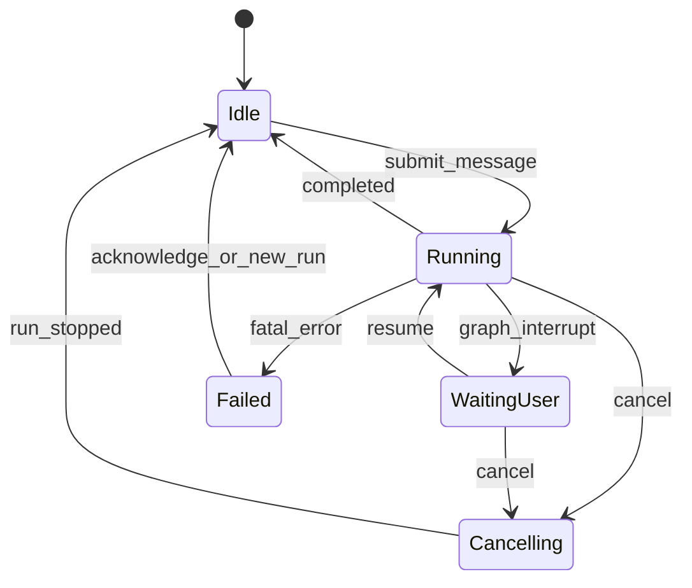
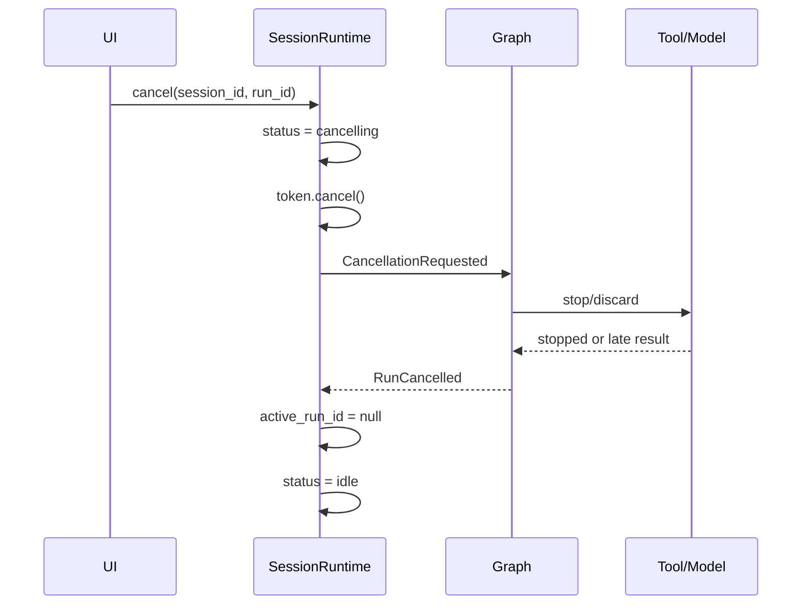

# 第一层：Session Runtime 详细设计

## 1. 目标

Session Runtime 是整个系统的运行隔离层，目标是确保：

- 不同会话互不污染并可并行运行；
- 同一会话中的任务按确定顺序执行；
- 每次请求都有独立、可追踪的 Run；
- 取消、恢复和迟到结果不会破坏会话；
- API、GUI 和 Graph 使用统一的会话状态；
- 后续可以从内存存储平滑迁移到 SQLite。

本层不理解用户任务语义，不调用 LLM 判断任务类型，也不决定使用哪个专业 Agent。

## 2. 核心概念

### 2.1 Session

Session 表示一段持续对话，是消息、任务和长期会话状态的归属边界。

```python
class SessionRecord(BaseModel):
    session_id: str
    title: str
    status: SessionStatus
    active_run_id: str | None
    created_at: datetime
    updated_at: datetime
    version: int
```

### 2.2 Run

Run 表示一次用户输入触发的完整执行过程。一个 Session 可以依次包含多个 Run，但同一时刻最多存在一个活动 Run。

```python
class RunRecord(BaseModel):
    run_id: str
    session_id: str
    status: RunStatus
    user_message_id: str
    checkpoint_id: str | None
    cancellation_requested: bool
    started_at: datetime
    finished_at: datetime | None
    error_code: str | None
```

### 2.3 Message

主会话消息只保存用户可感知的对话，不保存领域 Agent 的全部内部推理轨迹。

```python
class SessionMessage(BaseModel):
    message_id: str
    session_id: str
    run_id: str | None
    role: Literal["user", "assistant", "system"]
    content: str
    status: Literal["committed", "pending", "cancelled"]
    metadata: dict
    created_at: datetime
```

### 2.4 Event

Event 是运行事实，用于 GUI 调试、审计和问题诊断，不直接作为主会话消息。

```python
class RuntimeEvent(BaseModel):
    event_id: str
    session_id: str
    run_id: str
    sequence: int
    type: str
    payload: dict
    created_at: datetime
```

## 3. 状态设计

### 3.1 SessionStatus

```python
SessionStatus = Literal[
    "idle",
    "running",
    "waiting_user",
    "cancelling",
    "failed",
]
```

含义：

| 状态 | 含义 | 是否允许新消息 |
|---|---|---|
| `idle` | 没有活动 Run | 是 |
| `running` | Graph 正在执行 | 否 |
| `waiting_user` | 等待审批或澄清 | 否，只允许 Resume/Cancel |
| `cancelling` | 已请求取消，等待执行退出 | 否 |
| `failed` | 上次 Run 异常结束 | 是，创建新 Run 前先清理 |

### 3.2 状态转换



Session Runtime 只允许表中定义的转换。非法转换返回稳定错误码，而不是尝试自动修正。

## 4. 并发模型

### 4.1 每会话串行

每个 Session 拥有一个逻辑 mailbox 或锁：

```python
class LiveSession:
    lock: asyncio.Lock
    active_run_id: str | None
    cancellation_token: CancellationToken | None
```

同一会话：

```text
Run A 完成/取消
    → Run B 才能开始
```

不同会话：

```text
Session A / Run A ─┐
Session B / Run B ─┼─ 可以并行
Session C / Run C ─┘
```

### 4.2 乐观版本

持久化更新携带 `version`：

```sql
UPDATE sessions
SET status = ?, active_run_id = ?, version = version + 1
WHERE session_id = ? AND version = ?
```

更新行数为零表示发生并发冲突，必须重新加载，不得覆盖。

### 4.3 迟到结果

所有模型、工具和子任务结果在写入前检查：

```python
if result.run_id != session.active_run_id:
    return DiscardedResult(reason="stale_run")
```

迟到结果不得进入：

- conversation messages；
- completed tasks；
- memory；
-最终回答；
-当前 Graph checkpoint。

## 5. 取消设计

### 5.1 CancellationToken

```python
class CancellationToken:
    run_id: str
    _event: threading.Event

    def cancel(self) -> None: ...
    def is_cancelled(self) -> bool: ...
    def raise_if_cancelled(self) -> None: ...
```

### 5.2 取消流程



模型 SDK 无法真正取消 HTTP 请求时，可以放弃等待，但必须丢弃响应。Sandbox 和本地进程必须尝试终止进程树。

## 6. Interrupt与Resume

Graph 产生 interrupt 时，Session Runtime：

1. 保存 checkpoint；
2. 将 Session 状态设置为 `waiting_user`；
3. 返回 `interrupt_id` 和安全展示数据；
4. 仅接受匹配的 Resume 或 Cancel。

Resume 必须校验：

- session_id；
- active_run_id；
- interrupt_id；
- interrupt_type；
- payload schema；
- checkpoint 是否仍有效。

```python
class ResumeRequest(BaseModel):
    session_id: str
    run_id: str
    interrupt_id: str
    type: str
    payload: dict
```

## 7. SessionStore接口

业务层不得直接操作全局字典。

```python
class SessionStore(Protocol):
    def create_session(self, title: str) -> SessionRecord: ...
    def get_session(self, session_id: str) -> SessionRecord | None: ...
    def list_sessions(self) -> list[SessionRecord]: ...
    def delete_session(self, session_id: str) -> bool: ...

    def begin_run(
        self,
        session_id: str,
        user_message: SessionMessage,
    ) -> RunRecord: ...

    def set_session_status(
        self,
        session_id: str,
        expected_version: int,
        status: SessionStatus,
        active_run_id: str | None,
    ) -> SessionRecord: ...

    def append_message(self, message: SessionMessage) -> None: ...
    def append_event(self, event: RuntimeEvent) -> None: ...
    def finish_run(self, run_id: str, status: str) -> None: ...
```

首版实现：

```text
InMemorySessionStore
```

稳定后实现：

```text
SQLiteSessionStore
```

## 8. 对外接口

```python
class SessionRuntime:
    async def create_session(self, title: str = "新会话") -> SessionView: ...
    async def submit_message(
        self,
        session_id: str,
        message: str,
        options: RunOptions,
    ) -> RunResponse: ...
    async def resume(self, request: ResumeRequest) -> RunResponse: ...
    async def cancel(self, session_id: str, run_id: str) -> CancelResponse: ...
    async def get_session(self, session_id: str) -> SessionView: ...
```

HTTP 层只做：

- Schema 校验；
-调用 SessionRuntime；
-将领域异常映射为 HTTP 状态码。

HTTP 层不直接调用 Agent。

## 9. 错误模型

稳定错误码：

```text
SESSION_NOT_FOUND
SESSION_BUSY
RUN_NOT_FOUND
RUN_MISMATCH
RUN_CANCELLING
INTERRUPT_NOT_FOUND
INTERRUPT_EXPIRED
INVALID_RESUME_PAYLOAD
CONCURRENT_UPDATE
STORE_FAILURE
```

异常消息可以本地化，但错误码不得随文案变化。

## 10. 观测要求

必须记录：

- session_created；
- run_started；
- session_status_changed；
- interrupt_created；
- run_resumed；
- cancellation_requested；
- stale_result_discarded；
- run_completed；
- run_failed。

日志不得包含：

- API key；
-完整敏感文件内容；
-未经脱敏的环境变量；
-执行脚本中的秘密。

## 11. 测试要求

### 单元测试

- 状态转换表；
-重复 begin_run；
-错误 run_id 取消；
-错误 interrupt_id Resume；
-迟到结果丢弃；
-乐观版本冲突；
-删除活动会话。

### 并发测试

- 同会话两个消息同时提交，只有一个成功；
-不同会话可以同时运行；
- Cancel 后立即发送新消息会被拒绝；
-旧模型结果在新 Run 开始后返回，不得写入。

### 持久化测试

- checkpoint 保存与读取；
-进程模拟重启后等待审批状态仍存在；
-已完成 Run 不会重新执行。

## 12. 验收标准

- 同一 Session 不发生并发状态写入；
-不同 Session 可并行；
-取消后旧结果绝不进入主对话；
-等待用户时只能 Resume 或 Cancel；
-存储实现可替换；
-API 层不持有 Agent 实例状态；
-所有状态变化都有事件记录。

